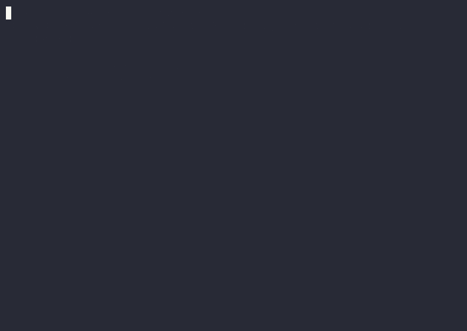

# Conductor

[](https://github.com/youjonathan/conductor/actions/workflows/test.yml)
[](LICENSE)
[](pyproject.toml)

*How many Claude Code terminals do you have open right now? How often are
you pasting output from one into another? For me, too often, so I built
them a bus.*

**Two Claude Code sessions collaborate on a codebase via a file-backed
message bus and an FSM-governed proposal ledger.** One session ("Planner")
scans for work and drafts proposals; another ("Builder") reviews and
executes them; a human approves the gate between drafting and execution.
This repo is the v1 adapter — a single-file Python CLI both sessions invoke
to read and mutate the shared state.

```
                     ┌──────────────────────────────────┐
                     │   $CONDUCTOR_DIR/                │
   ┌──────────┐      │   ├── Conductor Inbox.md         │      ┌──────────┐
   │ Planner  │◄────►│   ├── Conductor Proposals.md     │◄────►│ Builder  │
   │ (Claude) │      │   └── .conductor/{*.lock}        │      │ (Claude) │
   └──────────┘      └──────────────────────────────────┘      └──────────┘
                                   ▲
                                   │  approves / rejects
                              ┌─────────┐
                              │  Human  │
                              └─────────┘
```

A proposal's life is a finite-state machine:

```
   🔵 drafting  ──►  🟡 awaiting-jonathan  ──►  🟢 approved  ──►  ⚙️ in-progress  ──►  ✅ done
                                                                      ├── retry → 🟢
                                                                      └── escalate → 🟡
                              (any non-terminal state)  ──►  ⏸️ paused  ──►  (resume to prior)
                              (any non-terminal state)  ──►  ❌ rejected
```

Each transition is gated by which actor is allowed to make it (`planner`,
`builder`, `human`, or `codex`); the adapter enforces the table.

## Watch one full cycle



`scripts/demo.sh` runs the cycle above end-to-end through the CLI — Planner
drafts, Builder reviews, human approves, Builder executes and hands off to
Codex, Builder closes. One proposal in `✅ done`; full audit trail on the
bus. The GIF is regenerated from `scripts/demo.cast` with
[`agg`](https://github.com/asciinema/agg); a scrubbable version lives at
[asciinema.org/a/43RGDl67oKaAnQQr](https://asciinema.org/a/43RGDl67oKaAnQQr).

## Quickstart

```bash
git clone https://github.com/youjonathan/conductor.git && cd conductor
pytest -v              # 12 test files, full coverage of the op surface
./scripts/demo.sh      # run one full proposal lifecycle through the CLI
```

The demo script seeds a temp `CONDUCTOR_DIR`, runs the cycle
`🔵 → 🟡 → 🟢 → ⚙️ → ✅` through the CLI, and prints the resulting Inbox
and Proposals files. Pass `KEEP=1` to keep the temp dir around:

```bash
KEEP=1 ./scripts/demo.sh
```

## Invocation

```bash
export CONDUCTOR_DIR="/path/to/vault"   # contains the two .md files + .conductor/
python3 conductor.py <op> [--args...] [< body-on-stdin]
python3 conductor.py <op> --help        # per-op arguments
```

`CONDUCTOR_DIR` must contain:

```
$CONDUCTOR_DIR/
├── Conductor Inbox.md         # append-only message log
├── Conductor Proposals.md     # FSM-controlled ledger
└── .conductor/
    ├── inbox.lock             # flock target
    └── proposals.lock         # flock target
```

## Operations

| Op | Purpose |
|---|---|
| `inbox-append`        | Append a message to the bus. |
| `inbox-read`          | Read messages (filter by role/unacked/since/proposal). |
| `inbox-ack`           | Idempotently ack a message by id. |
| `proposal-create`     | Create a proposal (body via stdin; requires Summary / Motivation / Scope / Acceptance / Evidence sections). |
| `proposal-read`       | Read proposals (filter by id/status). |
| `proposal-edit-body`  | Edit a `🔵 drafting` proposal's body; bumps `version`. |
| `proposal-set-status` | FSM-validated status transition; atomic with an audit-note emit to the inbox. |
| `state`               | Compact JSON summary of bus state for session boot. |

Writes return the new message id or `ok`; reads return JSON.

## Concurrency

Two `flock`-based mutexes guard the on-disk files:

- Single-file writes acquire just `inbox.lock` or `proposals.lock`.
- Cross-file writes (status transitions, body edits) acquire **both**, in
  the fixed order `proposals.lock → inbox.lock`, to prevent deadlock.
- `proposal-set-status` is atomic: the Proposals file (rewritten via
  temp-file + rename) and the audit note appended to the Inbox both
  succeed or neither does.
- `inbox-ack` is idempotent — re-acking the same message from the same
  actor returns the existing ack id without writing.

## Architecture

`conductor.py` is intentionally one file with four layers:

1. **Domain types** — `Role`, `Kind`, `Verdict`, `Status` enums and the
   `Message` / `Proposal` dataclasses.
2. **Parsers / formatters** — the only code that touches the on-disk
   markdown grammar. Round-trip stable (`parse → format → parse`).
3. **Locking** — `inbox_lock()`, `proposals_lock()`, `supermutation()`.
4. **Operations** — `op_*` functions, each wired to an argparse subcommand
   in `build_parser()` and dispatched in `main()`.

See [`CLAUDE.md`](./CLAUDE.md) for a deeper walk-through aimed at agents
extending the adapter.

## v1 → v2

In v2, this CLI is replaced by an MCP server that exposes the same
operations as tools. The name mapping is mechanical: every kebab-case op
(`inbox-append`) becomes a snake_case tool (`inbox_append`); arguments and
return shapes are preserved 1:1. Role prompts do not change between v1
and v2.

## Tests

```bash
pytest -v                                    # all
pytest -v test_fsm.py                        # one file
pytest -v test_e2e_smoke.py::test_full_cycle_code_refactor   # one test
```

The e2e smoke test (`test_e2e_smoke.py`) is the canonical
end-to-end exercise; `scripts/demo.sh` is its CLI-level twin.

## Origins

Conductor started inside my personal Obsidian vault. A Planner Claude
Code session runs *in* the vault (where my notes, papers, and project
plans live); a Builder session runs in a code repo. A design doc
(`Conductor Design.md`, kept private) defines the protocol between
them. The four canonical `delegated_paths` prefixes
(`Projects/`, `Concepts/`, `Papers/`, `Personal/`) come from the
vault's top-level structure — that's why they're hardcoded.

The protocol generalizes: `CONDUCTOR_DIR` can be any directory you
want the two sessions to share. The vault is just where the
conventions came from.
